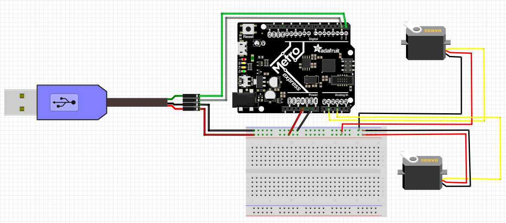

# Expert CircuitPython
This repo contains all of my expert circuitpy assignments

# Table of Contents
* [Bouncing Circle](#Bouncing-Circle)

* [Potentiometer speedometer](#Poteniometer-Speedometer)

* [Servo Swervo](#Servo-Swervo)

# Bouncing Circle

Assignment actuallly named Hello Processing.

## Discription

In this assignment we were introduced to processing and made a square with a circle bouncing around inside. 

## Lesson(s) Learned
* Processing more specifically how to draw in processing

##Picture
This is a picture of what it looks like.

# Potentiometer Speedometer

Assignment actually named CircuitPython to Processing.

## Discription

In this assignment we were to make a potentiometers value change the position of a line in processing to look like a speedometer. 

## Lesson(s) Learned

* What a UART(Universal Asynchronous Receiver/Transmitter) does: it converts USB signals to UART and back 

## Picture
This is a picture of the wiring

# Servo Swervo

Assignment actually called Processing to CircuitPython

## Discription 

In this assignment I made a GUI(graphical user interface) to capture the x and y position of my mouse to change the position of my 
servos. 

## Lesson(s) Learned
* How to turn number into a string to send them to Python ( numbers = str(int(X)) + "-" + str(int(Y)) + "*";)
* How to read those number and print them (myData = uart.read(1)
    if myData is not None:
        decoded = myData.decode("utf-8")
        print(decoded))

## Picture

This is a picture of the wiring

